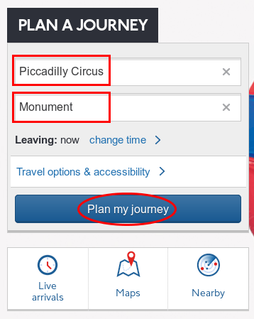
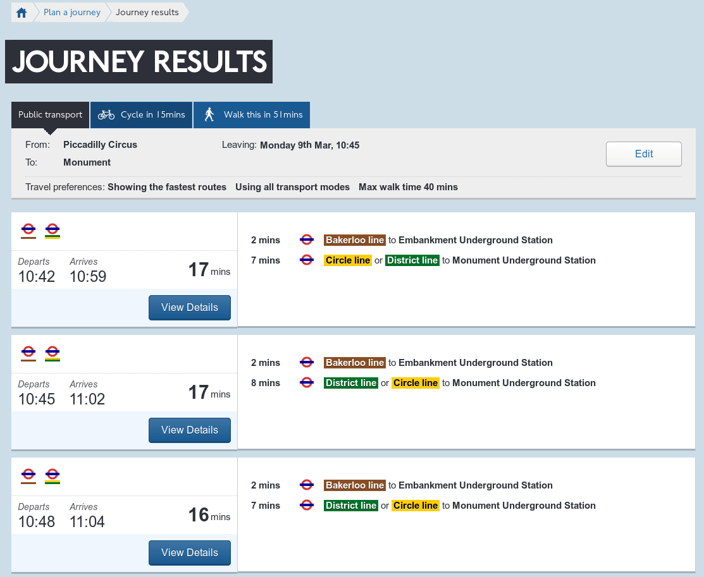
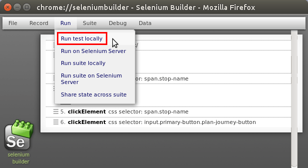

# Scenario audit of accessibility with Tanaguru

## Quick steps (for the impatient)

1. Have a Firefox and [download SeBuilder extension](http://www.saucelabs.com/addons/selenium-builder-latest.xpi)
1. Record your scenario (*Selenium 2* format)
1. Replay locally your scenario to verify it works
1. Upload the scenario to Tanaguru
1. Run the scenario audit

## 0. Prerequesite: Firefox + SeBuilder

You need a Firefox browser with the [SeBuilder extension](http://www.saucelabs.com/addons/selenium-builder-latest.xpi)
to record scenarios. Tanaguru scenarios are based on Selenium. The format is *Selenium 2* and scenarios are stored in JSON style.

## 1. Define a scenario

Let say we are in London at *Piccadilly Circus* and want to go to *Monument*. Let
use the [Transport for London website](http://www.tfl.gov.uk/) to help us define our journey.
We want to evalutate the accessibility of the following pages:

* the homepage with the form (where we will type in our departure and arrival),
* the result page giving us the different possible paths.

Let's begin.

* Go to [http://www.tfl.gov.uk/](http://www.tfl.gov.uk/)

## 2. Record the scenario

* Open SeBuilder: Tools > Web developer > Launch Selenium Builder (or keyboard 
shortcut `CTRL-ALT-B`), and select *Selenium 2*.

* In the *Tranport for London* page, fill in the *From* field (*Piccadilly circus*)
and *To* field (*Monument*)

* Click the *Plan my journey* button, and see the proposed journeys.

* In the SeBuilder window, click the *Stop recording* button:

* Save your scenario : File > Save as...

## 3. Verify and adjust the scenario

* In the SeBuilder window, choose Run > run test locally

This verification is important. Tanaguru just replays the scenario, he can't check
whether or not the scenario is actually what you wanted (!).

Please refer to [Tanaguru scenario advanced usage](userdoc-scenario-audit-advanced.md)
if the scenario does not replay the way you'd like.

## 4. Upload the scenario to Tanaguru

* Log in your Tanaguru, go to your project, *Scenario Audit*

* Name your scenario, select the file and upload it

## 5. Launch the audit of the scenario

* Now run the scenario: click *Launch audit*

Eventually, set options then launch the audit.

The scenario audit is ran in *asynchronous* mode, meaning you will receive an
email when the audit is done (depending on the lenght of the audit, but typically
a few minutes).

## 6. See the results

* Go back to your project page, click on the last audit 

* You have the summary of the scenario audit. Verify which pages have been tested
by clicking on the number of pages link

(If the number of pages is not the expected one, please check [Tanaguru scenario advanced usage](userdoc-scenario-audit-advanced.md))

You may then explore the detail of each audited page.

Scenarios are a powerful tool. Once created a scenario can be executed over and
over providing also regression testing in addition of accessibility testing.

